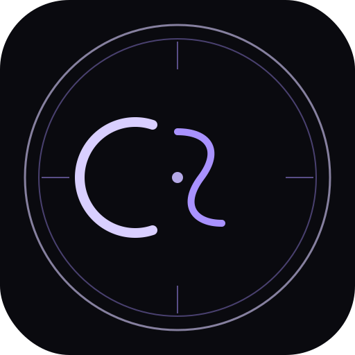

# CREOSIGIL

> **의도를 상징으로 완성하다** — 시길(Sigil) 제작 PWA



---

## 🔮 소개

**CREOSIGIL**은 당신의 의도를 이해하고, 선택을 도우며, 하나의 상징적 인장(시길)으로 완성하도록 안내하는 모바일 전용 PWA입니다.

- **시길(Sigil)**: 라틴어 *sigillum*(봉인)에서 유래. 개인의 의도나 바람을 상징으로 압축한 문양.
- **CREO**: 라틴어 "만들다, 창조하다"
- **CREOSIGIL**: "시길을 창조하다"

---

## ✨ 주요 기능

| 기능 | 설명 |
|------|------|
| 📖 시길 소개 | 시길의 의미와 제작 철학 안내 |
| 🎯 목적 선택 | 8가지 의도 목적 + 동적 조언 |
| ⊕ 전통형 시길 | 원형인장 / 마법진 / 봉인문 / 룬결합 / 의식대칭 / 월상결속 |
| ◈ 현대형 시길 | 미니멀로고 / 기하학 / 네온심볼 / 엠블럼 / 추상 / 크리스탈 |
| 🎨 분위기 선택 | 8가지 테마 (흑요석/월광/심홍/백색/황동/네온/미니멀/코스믹) |
| ✏️ 실시간 편집 | 크기/선굵기/광채/색상/배경/회전 조절 |
| 💾 고화질 저장 | HD(1080×1920) / QHD(1440×2560) / 4K(2160×3840) |
| ⬜ 투명 PNG | 다른 앱에서 재사용 가능한 투명 배경 이미지 |
| ✦ SVG 저장 | 벡터 포맷 저장 |
| ↑ 공유 | OS 공유 시트 (Web Share API) |
| 📦 보관함 | 최근 20개 저장, 다시 편집 가능 |
| ⬛ QR 생성기 | URL/텍스트 → QR 코드 → PNG 저장 |
| ▶ YouTube | https://youtube.com/@cursekey 바로 연결 |
| 📱 PWA | 홈 화면 설치, 오프라인 지원 |

---

## 🗂️ 파일 구조

```
creosigil/
├── index.html          # 메인 앱 (8단계 플로우)
├── manifest.json       # PWA 설정
├── sw.js               # 서비스 워커
├── .gitignore
├── README.md
├── css/
│   └── style.css       # 다크 오컬트 스타일 (Cinzel Decorative 폰트)
├── js/
│   ├── data.js         # 목적/옵션/분위기 데이터
│   ├── sigil-engine.js # Canvas 기반 시길 생성 엔진
│   └── app.js          # 앱 전체 로직
└── icons/
    └── icon.svg        # 앱 아이콘 (C+S 인장 디자인)
```

---

## 🚀 GitHub Pages 배포

```
1. GitHub에서 새 저장소 생성 (이름: creosigil)
2. 이 폴더의 파일 전체 업로드
3. Settings → Pages → Branch: main / Folder: / (root) → Save
4. https://[USERNAME].github.io/creosigil/ 로 접속
```

---

## 📱 폰에서 PWA 설치

- **iPhone**: Safari에서 열기 → 공유 → 홈 화면에 추가
- **Android**: Chrome에서 열기 → 메뉴 → 홈 화면에 추가 (또는 앱 설치)

---

## 🎨 앱 디자인

- **컬러**: 흑요석 검정 `#0a0a0f` + 페일 바이올렛 `#d9cfff` + 퍼플 글로우 `#a992ff`
- **폰트**: Cinzel Decorative (타이틀) + Cinzel (UI) + Noto Serif KR (본문)
- **무드**: Dark Occult + Minimal Luxury

---

## 🔗 링크

- **YouTube**: [https://youtube.com/@cursekey](https://youtube.com/@cursekey)

---

## 📄 라이선스

개인/비상업적 사용 자유. 상업적 사용 시 문의.
